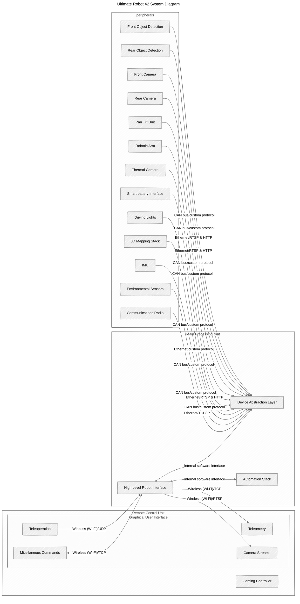

# System overview

This document shows the System Design of the **Ultimate Robot 42**.
The main components of the robotic system are:
- Main Processing Unit (MPU)
- Robot Peripherals (RP)
- Remote Control Unit (RCU)

The System is designed to provide fail safe teleoperation of the robot even in poor/unreliable communications.

## Main Processing Unit

The Main Processing Unit (MPU) is the robot's brain. It is in charge of:
- Translating the user input into actions that the robot should perform
- Managing and performing scheduled and autonomous tasks
- Providing feedback and telemetry of the overall system to the RCU
- Interfaces the Robots' Peripherals into a Device Abstraction Layer

The end user is able to replace some of the peripherals to suit better their application, for example a different model of Thermal Camera or Pan Tilt Unit is used. Therefore the Device Abstraction Layer is used to give a unified interface of the peripheral devices to the user and the internal services.

## Robot Peripherals

The Robot Peripherals is a collection of sensors, hardware interfaces and actuators that are distributed inside and on the deck of the robot. By nature some of this devices are close (<10 cm away) to the MPU and some devices are further away (>1.0 m away). Yet they are all interfaced to the MPU by wired connection.
The list of peripherals and its data transmission requirements is the following:
- Front Object Detection
  - Low latency small data packages
- Rear Object Detection
  - Low latency small data packages
- Front Camera
  - Low latency 30 FPS
- Rear Camera
  - Low latency 30 FPS
- Pan Tilt Unit
  - Medium latency small data packages
- Thermal Camera
  - Medium Latency 30 FPS
  - Capture images that are ~500KB
- Robotic Arm
  - Low Latency small data packages
- Smart Battery Interface
  - Low latency small data packages
- Driving Lights
  - Low latency small data packages
- 3D Mapping Stack
  - Low latency big data packages
- Inertial Measurement Unit
  - Low latency small data packages
- Communications Radio
  - Low Latency big and small data packages
- Environmental Sensors
  - Low latency small data packages

## Remote Control Unit

The Remote Control Unit (RCU) is a Linux Computer that has a network interface that allows it to communicate with the Robot via a COmmunications Radio, similar to the one on board of the Robot. It shows in the User Interface (UI) the feedback from the Robot's Cameras, sensors and different statuses. The user is able to control the Robot via a gaming controller connected to the RCU.

## System Architecture

The system architecture is shown in the diagram below.
### Instructions for the assessment
Make sure that you can see the diagram below. It is made using an open source format called Mermaid. there are online viewers for it and also GitHub has a built in preview of mermaid diagrams. Visual Studio also provide visualisation tools.

This is the section that is the main part of the assessment. In here you need to complete the diagram with all the information that you think is necessary for a clear overview of the system. You will need to take into account the previous description of the system. If any assumptions need to be made in order for a design decision to make sense, please state them clearly.

For each of the parts of the system define a communications physical layer, along with a protocol that might be suitable, for example: A Camera might have the requirement of streaming live video, and because it is inside the robot it can be connected via an ethernet cable. As for the protocol to stream the images/video, well that is part of the assessment.

### System Design

The robotic system is designed with modular architecture, enabling clear communication from hardware interfaces to the Graphical User Interface (GUI). Below is a overview of the physical layers, protocols, and design rationale.

#### Communication Layers and Protocols

- **Robot Peripherals to MPU**:
  - **Sensors and actuators** (Object Detection, Pan Tilt Unit, Robotic Arm, Smart Battery, IMU, Driving Lights, Environmental Sensors):
    - **Physical Layer:** CAN bus (wired)
    - **Protocol:** Custom/CANopen (low-latency, small data)

  - **Cameras and 3D Mapping:**
    - **Physical Layer:** Ethernet
    - **Protocol:** RTSP (video streams), HTTP (control), custom UDP (3D mapping)

  - **Communications Radio (internal to MPU):**
    - **Physical Layer:** Ethernet
    - **Protocol:** TCP/IP

- **MPU ↔ RCU (Remote Control Unit):**
  - **Physical Layer:** Wi-Fi (802.11)
  - **Protocol:** UDP (teleoperation), TCP (telemetry), RTSP (video streams)

#### Design Rationale
- **CAN Bus:** Reliable and efficient for real-time control and sensor data.
- **Ethernet & RTSP:** High bandwidth needed for camera streaming and mapping data.
- **Wi-Fi:** Provides suitable range, bandwidth, and low latency for teleoperation.
- **TCP vs UDP:** UDP prioritizes speed (critical commands), TCP ensures data integrity (telemetry).

## Diagram:

#### Summary Table of Connections

| **Component**                    | **Connected To** | **Physical Layer** | **Protocol**                      |
|----------------------------------|------------------|--------------------|-----------------------------------|
| Front Object Detection           | DAL              | CAN bus            | Custom protocol                   |
| Front Camera                     | DAL              | Ethernet           | RTSP (streaming), HTTP (control)  |
| Communications Radio             | DAL              | Ethernet           | TCP/IP                            |
| HLRI to Teleoperation (RCU)      | RCU              | Wireless (Wi-Fi)   | UDP                               |
| HLRI to Telemetry (RCU)          | RCU              | Wireless (Wi-Fi)   | TCP                               |
| HLRI to Camera Streams (RCU)     | RCU              | Wireless (Wi-Fi)   | RTSP                              |

#### Design Choices and Assumptions
- CAN bus is suitable for low-latency, small-data peripherals, given its use in automotive and robotics
- Ethernet is chosen for high-bandwidth devices, aligning with standard practices for video and large data transfer
- The Communications Radio provides a network interface over Ethernet, simplifying wireless integration.
- Components within robot (<1m) use wired CAN/Ethernet.
- Wi-Fi provides sufficient range and low latency.
- The environment is free from significant interference.
